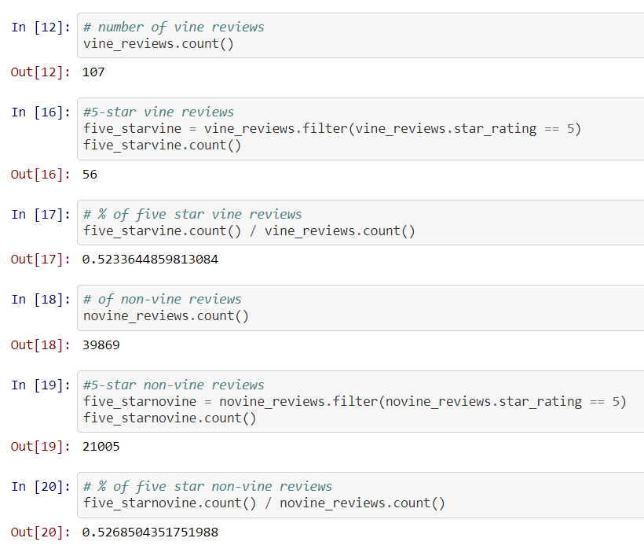

# Amazon_Vine_Analysis

## Purpose of Analysis
The purpose of this analysis is to understand whether how many Amazon reviews for the US Outdoors product category are paid for via the Vine program, and then see if there is a positivity bias among those reviews.

## Results
* How many Vine reviews and non-Vine reviews were there?
     * Vine Reviews= 107
     * Non-Vine Reviews= 39,869

* How many Vine reviews were 5 stars and non-Vine reviews were 5-stars?
     * 5 star Vine Reviews= 56
     * 5 star Non-Vine Reviews= 21,005

* What percentage of Vine reviews were 5 stars and what percentage of non-Vine reviews were 5-stars?
     * 5 star Vine Review %= 52.3%
     * 5 star Non-Vine Review %= 52.7%

 
     
## Results
Based on the results of the US Outdoors category vine review analysis, I do not see a positivity bias as a slightly higher percentage of non-vine reviews were actually 5 star reviews. It is worth mentioning and considering the fact that a very small percentage of the total reviews were actually vine reviews. Because of this, repeat analysis within each other category, along with all categories in general, would give us a more clear understanding of positivity bias within the program.


```bash
Kyle Schneider, 1/3/2020
```
